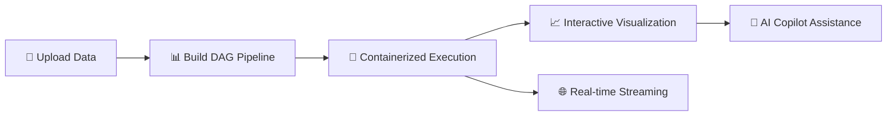

<p align="center">
  
</p>

<p align="center">
  <h1 align="center">gobrave</h1>
  <p align="center"><strong>Bioinformatics Reactive Analysis & Visualization Engine — built in Go</strong></p>
</p>

<p align="center">
  <a href="https://gobravedev.github.io/gobrave-doc/"></a>
  <a href="https://github.com/biox-dev/gobrave/blob/main/LICENSE"></a>
  
  
</p>

---

## 🧬 What is gobrave?

**gobrave** is a high-performance bioinformatics platform that bridges the gap between **pipeline engineering** and **scientific discovery**. Built from the ground up in Go, it delivers unparalleled speed, a single-binary deployment, and a modern architecture designed for scale.

> 🚀 One binary. Zero friction. From raw data to publication-ready insights.



---

## ✨ Why gobrave?

| Traditional Platforms | ⚡ gobrave |
|---|---|
| Multi-process deployment | **Single static binary** |
| Complex dependency management | **Zero runtime deps** |
| Limited concurrency model | **Native goroutine parallelism** |
| Heavy memory footprint | **~30 MB memory baseline** |
| Lengthy install & config | **Download & run** |

---

## 🎯 Core Capabilities

### ⚙️ Visual DAG Workflow Engine
Design complex bioinformatics pipelines as **directed acyclic graphs** — no code required.

- 🎨 Drag-and-drop node composition (R, Python, Shell)
- 🔄 Automatic upstream → downstream data propagation
- 💾 Smart caching: skip unchanged nodes, re-run only what's needed
- 🧩 Scatter/gather patterns for parallel sample processing
- ♻️ Crash recovery with heartbeat-based lease locking

### 🐳 Containerized Analysis Workspaces
Launch full analysis environments **on demand**, right from your pipeline.

- **RStudio Server** · **JupyterLab** · **VS Code Server** — one-click launch
- Docker & Kubernetes runtime support
- Auto-provisioned reverse proxy (Traefik / K8s Ingress / built-in gateway)
- User-namespaced, isolated containers with host UID mapping


### 🌐 Real-time Collaboration
Stay in sync with every event in the system.

- **WebSocket + SSE** dual-transport realtime hub
- Per-user connection pooling with automatic eviction
- Live DAG execution progress, node status, and container events
- Frontend actions bridged via unified event bus

### 📁 Data Management
Organize your research artifacts with project-scoped CRUD.

- Datasets, Samples, Files — hierarchical, cross-referenced
- Role-based file annotation (e.g. FASTQ_R1, FASTQ_R2)
- Bulk import & project-level listing
- Transactional integrity with cascading cleanup


---

## 🏗️ Architecture

```
┌─────────────────────────────────────────────────────────┐
│                     Frontend (SPA)                       │
├─────────────────────────────────────────────────────────┤
│  REST API  │  WebSocket  │  SSE  │  Reverse Proxy       │
├─────────────────────────────────────────────────────────┤
│  ┌─────────┬──────────┬──────────┬──────────────────┐   │
│  │   Auth   │ Project  │   Data   │    Analysis      │   │
│  ├─────────┼──────────┼──────────┼──────────────────┤   │
│  │ Container│ Workflow │ Realtime │    LLM Bridge    │   │
│  └─────────┴──────────┴──────────┴──────────────────┘   │
├─────────────────────────────────────────────────────────┤
│                  DAG Orchestrator                        │
│  ┌──────────┬──────────┬──────────┬────────────────┐    │
│  │ Scheduler│Dispatcher│WorkerPool│ State Machine  │    │
│  └──────────┴──────────┴──────────┴────────────────┘    │
├─────────────────────────────────────────────────────────┤
│              Container Runtime (Docker / K8s)            │
├─────────────────────────────────────────────────────────┤
│              Route Registry (Traefik / Gateway)          │
└─────────────────────────────────────────────────────────┘
```

---

## 🚀 Quick Start

### Prerequisites
- Go **≥ 1.25**
- MySQL **8.0+**
- Docker / Kubernetes / k3s (for containerized execution)

### Install & Run

```bash
# Clone
git clone https://github.com/biox-dev/gobrave.git
cd gobrave

# Configure
cp config.example.yml config.yml
# Edit config.yml with your database & settings

# Run (it's that simple)
go run ./cmd/server
```

### Install via `go install`

```bash
# Install the latest version into $GOPATH/bin (or $GOBIN)
go install github.com/biox-dev/gobrave/cmd/server@latest

# Configure
cp config.example.yml config.yml
# Edit config.yml with your database & settings

# Run
gobrave
```

> **Note:** `go install` builds a plain binary without the embedded frontend.
> For a single executable with the frontend bundled, see
> [Build a Single Executable with Embedded Frontend](#build-a-single-executable-with-embedded-frontend).

### Build a Static Binary

```bash
# Build for your platform
go build -o gobrave ./cmd/server
# Run the binary
./gobrave
```

### Build a Single Executable with Embedded Frontend

```bash
# 1) Build frontend artifacts into gobrave/web first (for example: copy brave-ui dist)
# 2) Build server with embedded frontend assets
go build -tags embed_frontend -o gobrave ./cmd/server

# Run as a single executable (no external web directory required at runtime)
./gobrave
```

### Run with Docker

```bash
# Build Docker image
docker build -t gobrave:latest .
# Run container
docker run -d -p 8082:8082 --name gobrave gobrave:latest
```


```bash
docker run --rm -p 8082:8082  -it registry.cn-hangzhou.aliyuncs.com/wybioinfo/gobrave 
```

### Run with Command-Line Database Configuration

You can override database settings directly via CLI flags — no config file needed. Timezone is fixed to **UTC** in all database DSNs.

```bash
# 1) Start MySQL via Docker
docker run -d --rm -p 53306:3306 \
   --name mysql \
   -e MYSQL_ROOT_PASSWORD=123456 \
   -e LANG=C.UTF-8 \
   --shm-size=10G \
   -v /home/admin/data/mysql:/var/lib/mysql \
   registry.cn-hangzhou.aliyuncs.com/wybioinfo/mysql:8.0.21 \
   --default-authentication-plugin=mysql_native_password \
   --character-set-server=utf8mb4 \
   --lower-case-table-names=1 \
   --collation-server=utf8mb4_unicode_ci
# 2) Create database
docker exec -it mysql mysql -uroot -p123456 -e "CREATE DATABASE brave CHARACTER SET utf8mb4 COLLATE utf8mb4_unicode_ci;"

# 3) Download the latest release (single binary with embedded frontend)
wget https://github.com/biox-dev/gobrave/releases/download/v0.1.0/gobrave-v0.1.0-linux-amd64-embed -O gobrave
chmod +x gobrave

# 4) Run gobrave with CLI-specified database (no config.yml needed)
export GOBRAVE_BASE_DIR=/home/admin/.brave
./gobrave \
   --db-driver=mysql \
   --db-host=localhost \
   --db-port=53306 \
   --db-user=root \
   --db-password=123456 \
   --db-name=brave \
   --runtime=docker
```

> **Note:** The database timezone is hardcoded to **UTC** in the connection string (`loc=UTC` for MySQL, `TimeZone=UTC` for PostgreSQL). Make sure your application logic accounts for UTC timestamps.

Available CLI flags for database:

| Flag | Description | Default (MySQL) |
|------|-------------|-----------------|
| `--db-driver` | Database driver: `mysql`, `postgres`, or `sqlite` | `sqlite` |
| `--db-host` | Database host | `127.0.0.1` |
| `--db-port` | Database port | `3306` |
| `--db-user` | Database user | — |
| `--db-password` | Database password | — |
| `--db-name` | Database name | — |
| `--db-path` | SQLite database file path | `$GOBRAVE_BASE_DIR/db/gobrave.db` |
| `--db-ssl-mode` | SSL mode (PostgreSQL only) | `disable` |
| `--runtime` | Container runtime: `docker`, `k8s`, or `k3s` | `docker` |


---

## Runtime Environment
### K3s
```bash
# Install k3s (lightweight Kubernetes)
curl -sfL https://get.k3s.io | sh -
sudo cp /etc/rancher/k3s/k3s.yaml ~/.kube/config
# Check k3s status
kubectl get nodes

# Check kubectl version
kubectl version --client
```


## 📖 Documentation

Full documentation at **[gobrave.dev](https://gobrave.dev)**

- [Getting Started](https://gobrave.dev/docs/getting-started)
- [DAG Pipeline Guide](https://gobrave.dev/docs/dag)
- [Container Workspaces](https://gobrave.dev/docs/containers)
- [AI Copilot](https://gobrave.dev/docs/copilot)
- [API Reference](https://gobrave.dev/docs/api)

---

## 🤝 Contributing

We welcome contributions! See [CONTRIBUTING.md](CONTRIBUTING.md) for guidelines.

---

## 📄 License

gobrave is open-source under the [MIT License](LICENSE).

---

<p align="center">
  <sub>Built with ❤️ by the <a href="https://github.com/gobravedev">gobrave team</a> · Powered by Go</sub>
</p>
