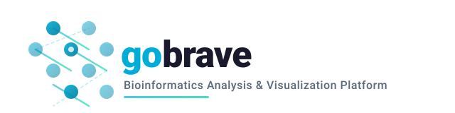
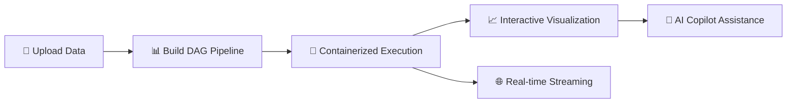

<p align="center">
  
</p>

<p align="center">
  <h1 align="center">gobrave</h1>
  <p align="center"><strong>Bioinformatics Reactive Analysis & Visualization Engine — built in Go</strong></p>
</p>

<p align="center">
  <a href="https://gobravedev.github.io/gobrave-doc/"></a>
  <a href="https://github.com/gobravedev/gobrave/blob/main/LICENSE"></a>
  
  
</p>

---

## 🧬 What is gobrave?

**gobrave** is a high-performance bioinformatics platform that bridges the gap between **pipeline engineering** and **scientific discovery**. Built from the ground up in Go, it delivers unparalleled speed, a single-binary deployment, and a modern architecture designed for scale.

> 🚀 One binary. Zero friction. From raw data to publication-ready insights.



---

## ✨ Why gobrave?

| Traditional Platforms | ⚡ gobrave |
|---|---|
| Multi-process deployment | **Single static binary** |
| Complex dependency management | **Zero runtime deps** |
| Limited concurrency model | **Native goroutine parallelism** |
| Heavy memory footprint | **~30 MB memory baseline** |
| Lengthy install & config | **Download & run** |

---

## 🎯 Core Capabilities

### ⚙️ Visual DAG Workflow Engine
Design complex bioinformatics pipelines as **directed acyclic graphs** — no code required.

- 🎨 Drag-and-drop node composition (R, Python, Shell)
- 🔄 Automatic upstream → downstream data propagation
- 💾 Smart caching: skip unchanged nodes, re-run only what's needed
- 🧩 Scatter/gather patterns for parallel sample processing
- ♻️ Crash recovery with heartbeat-based lease locking

### 🐳 Containerized Analysis Workspaces
Launch full analysis environments **on demand**, right from your pipeline.

- **RStudio Server** · **JupyterLab** · **VS Code Server** — one-click launch
- Docker & Kubernetes runtime support
- Auto-provisioned reverse proxy (Traefik / K8s Ingress / built-in gateway)
- User-namespaced, isolated containers with host UID mapping


### 🌐 Real-time Collaboration
Stay in sync with every event in the system.

- **WebSocket + SSE** dual-transport realtime hub
- Per-user connection pooling with automatic eviction
- Live DAG execution progress, node status, and container events
- Frontend actions bridged via unified event bus

### 📁 Data Management
Organize your research artifacts with project-scoped CRUD.

- Datasets, Samples, Files — hierarchical, cross-referenced
- Role-based file annotation (e.g. FASTQ_R1, FASTQ_R2)
- Bulk import & project-level listing
- Transactional integrity with cascading cleanup


---

## 🏗️ Architecture

```
┌─────────────────────────────────────────────────────────┐
│                     Frontend (SPA)                       │
├─────────────────────────────────────────────────────────┤
│  REST API  │  WebSocket  │  SSE  │  Reverse Proxy       │
├─────────────────────────────────────────────────────────┤
│  ┌─────────┬──────────┬──────────┬──────────────────┐   │
│  │   Auth   │ Project  │   Data   │    Analysis      │   │
│  ├─────────┼──────────┼──────────┼──────────────────┤   │
│  │ Container│ Workflow │ Realtime │    LLM Bridge    │   │
│  └─────────┴──────────┴──────────┴──────────────────┘   │
├─────────────────────────────────────────────────────────┤
│                  DAG Orchestrator                        │
│  ┌──────────┬──────────┬──────────┬────────────────┐    │
│  │ Scheduler│Dispatcher│WorkerPool│ State Machine  │    │
│  └──────────┴──────────┴──────────┴────────────────┘    │
├─────────────────────────────────────────────────────────┤
│              Container Runtime (Docker / K8s)            │
├─────────────────────────────────────────────────────────┤
│              Route Registry (Traefik / Gateway)          │
└─────────────────────────────────────────────────────────┘
```

---

## 🚀 Quick Start

### Prerequisites
- Go **≥ 1.25**
- MySQL **8.0+**
- Docker / Kubernetes / k3s (for containerized execution)

### Install & Run

```bash
# Clone
git clone https://github.com/gobravedev/gobrave.git
cd gobrave

# Configure
cp config.example.yml config.yml
# Edit config.yml with your database & settings

# Run (it's that simple)
go run ./cmd/server
```

### Build a Static Binary

```bash
# Build for your platform
go build -o gobrave ./cmd/server
# Run the binary
./gobrave
```

### Build a Single Executable with Embedded Frontend

```bash
# 1) Build frontend artifacts into gobrave/web first (for example: copy brave-ui dist)
# 2) Build server with embedded frontend assets
go build -tags embed_frontend -o gobrave ./cmd/server

# Run as a single executable (no external web directory required at runtime)
./gobrave
```

## Run with Docker

```bash
# Build Docker image
docker build -t gobrave:latest .
# Run container
docker run -d -p 8082:8082 --name gobrave gobrave:latest
```


```bash
docker run --rm -p 8082:8082  -it registry.cn-hangzhou.aliyuncs.com/wybioinfo/gobrave 
```


---

## 📖 Documentation

Full documentation at **[gobrave.dev](https://gobrave.dev)**

- [Getting Started](https://gobrave.dev/docs/getting-started)
- [DAG Pipeline Guide](https://gobrave.dev/docs/dag)
- [Container Workspaces](https://gobrave.dev/docs/containers)
- [AI Copilot](https://gobrave.dev/docs/copilot)
- [API Reference](https://gobrave.dev/docs/api)

---

## 🤝 Contributing

We welcome contributions! See [CONTRIBUTING.md](CONTRIBUTING.md) for guidelines.

---

## 📄 License

gobrave is open-source under the [MIT License](LICENSE).

---

<p align="center">
  <sub>Built with ❤️ by the <a href="https://github.com/gobravedev">gobrave team</a> · Powered by Go</sub>
</p>
