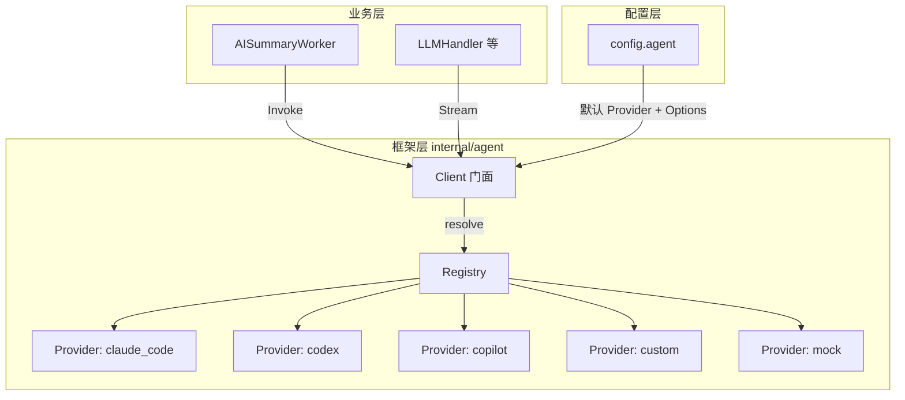
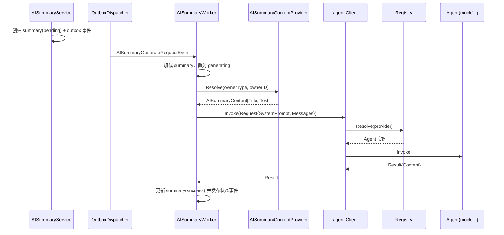
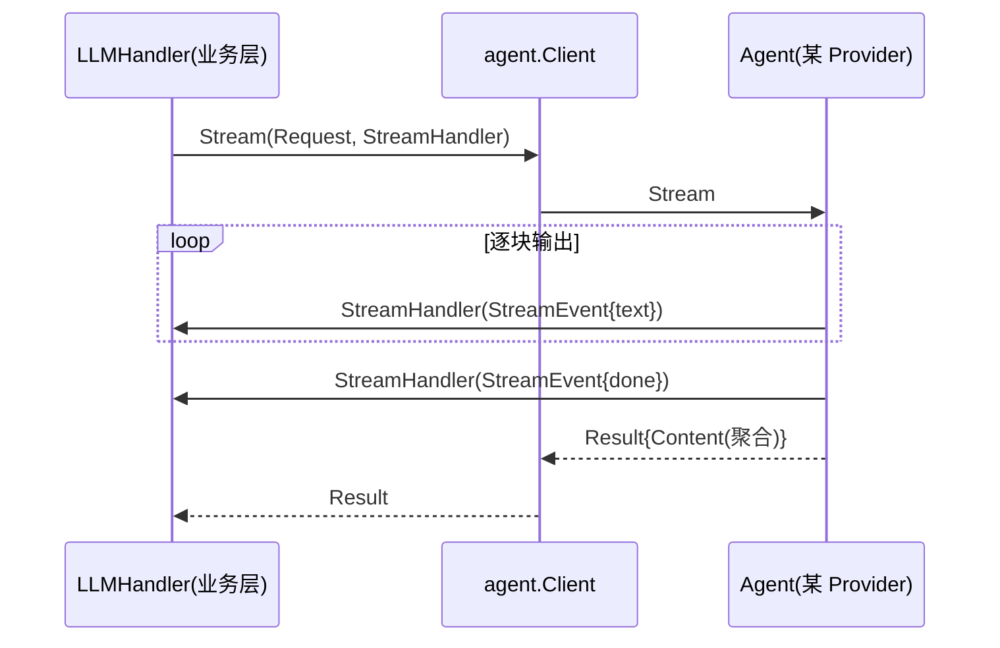

# AI Agent 调用框架设计

## 1. 目标

统一抽象第三方 Agent（Claude Code / Codex / Copilot）与后续自研 Agent 的调用方式，向上层业务
提供两种调用语义：

| 语义 | 接口 | 适用场景 |
| --- | --- | --- |
| 一次性任务 | `Agent.Invoke` | AI 摘要生成、后台异步任务（如 `AISummaryWorker`） |
| 流式请求 | `Agent.Stream` | 前端聊天、边生成边推送（如 `LLMHandler` bridge） |

## 2. 目录结构

```
internal/agent/
├── agent.go          # 核心类型与接口：Message / Request / Result / StreamEvent / Agent
├── registry.go       # Provider 工厂接口 + Registry（注册 / 解析）
├── client.go         # Client 门面：Invoke / Stream 统一入口
└── providers/        # 内置 Provider 实现
    ├── providers.go  # All()：汇总全部 Provider 供容器注册
    ├── mock.go       # 自研 mock（保证链路可跑通）
    ├── claude_code.go# Claude Code（占位）
    ├── codex.go      # Codex（占位）
    ├── copilot.go    # Copilot（占位，后续复用 copilot-sdk bridge）
    ├── custom.go     # 自研 Agent（占位）
    └── stub.go       # notImplementedProvider 占位基类
```

## 3. 分层与职责



- **`Agent`**：统一调用接口，每个 Provider 实现 `Invoke` / `Stream`。
- **`Provider`**：工厂，按 `Options` 构建 `Agent` 实例。
- **`Registry`**：按名称注册 / 解析 Provider，新增 Provider 只需实现 + 注册。
- **`Client`**：门面，业务层只依赖它；负责解析默认 Provider 并转发调用。

## 4. 一次性任务调用链路（以 AISummaryWorker 为例）



`AISummaryWorker.process` 的伪代码：

```
加载 summary → 置为 generating → 发布状态
  → contentProvider.Resolve(ownerType, ownerID)   // 解析 Analysis/AnalysisNode 原始内容
  → agentClient.Invoke(Request{SystemPrompt, user 消息})
  → 写回 summary.Content / Title / Status(success)
  → 发布状态
```

失败路径：将 summary 置为 `failed` 并发布状态；返回错误后由 `handleGenerateRequest`
将 outbox 事件标记回 `pending`（当前策略为可重试，后续可引入永久失败不再重试）。

## 5. 流式调用链路（预留）



`StreamHandler` 由业务层注入，实现「边生成边推送」；`Stream` 最终仍返回聚合 `Result`
以便持久化完整内容。

## 6. 如何接入新 Agent

1. 在 `internal/agent/agent.go` 登记 Provider 名称常量（如 `ProviderXxx`）。
2. 在 `internal/agent/providers/` 新建文件，实现 `agent.Provider` 与 `agent.Agent` 接口。
3. 在 `providers/providers.go` 的 `All()` 中注册。
4. 在 `config.agent.providers` 增加对应配置（可选）。
5. 将 `config.agent.default` 指向新 Provider，或请求时通过 `Request.Provider` 覆盖。

## 7. 配置示例

```yaml
agent:
  default: mock          # 默认 Provider
  providers:
    copilot:
      model: "deepseek-v4-pro"
      base_url: ""
      api_key: "sk-***"
      working_dir: ""
      extra: {}
```

## 8. 后续待办

- [ ] 为 `copilot` 复用现有 copilot-sdk bridge 逻辑，实现真实 `Invoke` / `Stream`。
- [ ] 为 `claude_code` / `codex` 接入对应 CLI 的 JSON-RPC / SSE 调用。
- [ ] `AISummaryContentProvider` 读取真实 output 文件内容。
- [ ] 流式摘要：`AISummaryWorker` 切换为 `Stream`，逐块推送前端。
- [ ] 失败重试 / 退避策略与永久失败识别。
